# Solana Token Pump

## Deployment & Testing

### Testing on localnet

```
# Testing on localnet

anchor build

make set-localnet

make test-localnet
```

### Deployment & Testing on devnet

Firstly, go to programs/solana-token-pump/Cargo.toml and add "devnet" to default features:

```
[features]
>> + default = ["devnet"]
>> - default = []
cpi = ["no-entrypoint"]
no-entrypoint = []
no-idl = []
no-log-ix-name = []
devnet = ["raydium-cpmm-cpi/devnet"]
localnet = []
idl-build = ["anchor-lang/idl-build", "anchor-spl/idl-build"]
```

Then set current cluster config to devnet

```
make set-devnet
```

Build for devnet

```
make build-devnet
```

Then you should have enough required SOLs amount needed for deployment, you can go to [faucet.solana.com ](https://faucet.solana.com/) to airdrop some to you current wallet with the keypair path is configured in `Anchor.toml` file.

```
[provider]
cluster = "Localnet"
wallet = "~/.config/solana/id.json"
```

You can just get the Public Key to conduct airdrop by running this command.

```
solana-keygen pubkey ~/.config/solana/id.json
```

Now you can deploy your program to devnet

```
make deploy-devnet
```

Once deployment is success, the shell will show the program ID. Then you should copy the program id and put it in `DEVNET_CONFIG` -> `programId` to in `tests/Anchor` for setting env purpose

```
export const DEVNET_CONFIG: TestingConfig = {
  name: "DEV",
  url: "https://api.devnet.solana.com",
  programId: new PublicKey("GiKGBhyg7fSGrc1sBA9G4qCSr4aZAtrpkYgvBCP96zZM"), // Update Program Id at here
  cmmppProgram: new PublicKey("CPMDWBwJDtYax9qW7AyRuVC19Cc4L4Vcy4n2BHAbHkCW"),
  raydiumAmmConfig: new PublicKey(
    "9zSzfkYy6awexsHvmggeH36pfVUdDGyCcwmjT3AQPBj6"
  ),
};
```

Setup what you wanna test in devnet.test_cases/test_playground.ts

```
...

describe("PLAYGROUND", async () => {
  const MOCKED_TOKEN_METADATA = {
    name: "Test Token 1",
    symbol: "TESTO",
    uri: "https://5vfxc4tr6xoy23qefqbj4qx2adzkzapneebanhcalf7myvn5gzja.arweave.net/7UtxcnH13Y1uBCwCnkL6APKsge0hAgacQFl-zFW9NlI",
    hash: "u38iaKy660r5g8LJzCjJh34j2345",
  };

  it(`Init Marketplace`, async () => {
    const marketplaceOwner = await getCurrentWallet(
    "tests/test_accounts/devnet/marketplace_owner.json"
  );

....
```

Adjust test script in `Anchor.toml`

```
...

[scripts]
dir = ""
# Run test on Localnet
# test = 'yarn run ts-mocha -p ./images/tsconfig.json -t 1000000 tests/test_cases/marketplace.test.ts tests/test_cases/create_token.test.ts'
# Run test on Devnet
test = 'yarn run ts-mocha -p ./images/tsconfig.json -t 1000000 tests/devnet.test_cases/*.test.ts'

...
```

Then you can run test by

```
make test-devnet
```

## Interacting with Solana

### [Solana Transaction and Instruction](https://solana.com/docs/core/transactions)

> Transactions include one or more [instructions](https://solana.com/docs/core/transactions#instruction), each representing a specific operation to be processed. The execution logic for instructions is stored on [programs](https://solana.com/docs/core/programs) deployed to the Solana network, where each program stores its own set of instructions.

Below are key details about how transactions are executed:

- Execution Order: If a transaction includes multiple instructions, the instructions are processed in the order they are added to the transaction.
- Atomicity: A transaction is atomic, meaning it either fully completes with all instructions successfully processed, or fails altogether. If any instruction within the transaction fails, none of the instructions are executed.
  

### [Solana Transaction Fee](https://solana.com/docs/core/fees)

> The Solana blockchain has a few different types of fees and costs that are incurred to use the permissionless network. These can be segmented into a few specific types:
> Transaction Fees - A fee to have validators process transactions/instructions
> Prioritization Fees - An optional fee to boost transactions processing order
> Rent - A withheld balance to keep data stored on-chain

#### Transaction Fees

Currently, the base Solana transaction fee is set at a static value of 5k lamports per signature. On top of this base fee, any additional [prioritization fees](https://solana.com/docs/core/fees#prioritization-fee) can be added.

Should any of the instructions return an error or violate runtime restrictions, all account changes _**except**_ the transaction fee deduction will be rolled back. This is because the validator network has already expended computational resources to collect transactions and begin the initial processing.

#### Compute Budget

To prevent abuse of computational resources, each transaction is allocated a "_compute budget_". This budget specifies details about [compute units](https://solana.com/docs/core/fees#compute-units) and includes:

- the compute costs associated with different types of operations the transaction may perform (compute units consumed per operation),
- the maximum number of compute units that a transaction can consume (compute unit limit),
- and the operational bounds the transaction must adhere to (like account data size limits)

#### Prioritization Fees

As part of the [Compute Budget](https://solana.com/docs/core/fees#compute-budget), the runtime supports transactions paying an **optional** fee known as a _"prioritization fee"_. Paying this additional fee helps boost how a transaction is prioritized against others when processing, resulting in faster execution times.

A transaction's prioritization fee is calculated by multiplying its _**compute unit limit**_ by the _**compute unit price**_ (measured in _micro-lamports_)

#### Rent

The fee deposited into every [Solana Account](https://solana.com/docs/core/accounts) to keep its associated data available on-chain is called "_rent_". This fee is withheld in the normal lamport balance on every account and reclaimable when the account is closed.

**Mint**

Tokens on Solana are uniquely identified by the address of a [Mint Account](https://github.com/solana-labs/solana-program-library/blob/b1c44c171bc95e6ee74af12365cb9cbab68be76c/token/program/src/state.rs#L18-L32) owned by the Token Program. This account is effectively a global counter for a specific token, and stores data such as:

- Supply: Total supply of the token
- Decimals: Decimal precision of the token
- Mint authority: The account authorized to create new units of the token, thus increasing the supply
- Freeze authority: The account authorized to freeze tokens from being transferred from "token accounts"

### **Account implied default signer **

Currently in testing code, we don't have to explicit define the signer in `accounts` cause these default signer accounts are implied account of current wallet by anchor. Reference: [setup_test.ts](<https://gitlab.var-meta.com/solana-token-pump/solana-token-pump-program/-/blob/main/tests/utils/setup_test.ts?ref_type=heads#:~:text=const%20connection%20%3D,(customProvider)%3B>)

We don't need to explicitly define these accounts in transactions.

```
...

  const connection = new Connection("http://127.0.0.1:8899", "confirmed");
  const customWallet = new anchor.Wallet(walletKeyPair);
  const customProvider = new anchor.AnchorProvider(connection, customWallet, {
    preflightCommitment: "confirmed",
  });
  anchor.setProvider(customProvider);

...
```

### Account derive by program

[Program Derived Addresses (PDA)](https://solana.com/docs/core/pda) refer to a feature of Solana development that allows you to create a unique address derived deterministically from pre-defined inputs (seeds) and a program ID.

We don't need to explicitly define these accounts in transactions.

You can get PDA by using seed

```
import { PublicKey } from "@solana/web3.js";

const programId = new PublicKey("11111111111111111111111111111111");
const string = "helloWorld";

const [PDA, bump] = PublicKey.findProgramAddressSync(
  [Buffer.from(string)],
  programId,
);

console.log(`PDA: ${PDA}`);
console.log(`Bump: ${bump}`);

```

| PDA                        | seed                                                                                  | Role                                                                                                                                                                                                       |
| -------------------------- | ------------------------------------------------------------------------------------- | ---------------------------------------------------------------------------------------------------------------------------------------------------------------------------------------------------------- |
| Marketplace                | "marketplace"                                                                         | <ul><li>Store Marketplace states</li><li>Authority for Fee Vault</li></ul>                                                                                                                                 |
| Fee Vault                  | <p>"fee_vault", </p><p>marketplace address</p>                                        | <ul><li>An associated account used as vault for all trading fees in marketplace, owner claim fees from this vault</li><li>Authorized by Marketplace</li></ul>                                              |
| Knowledge Swap             | <p>"ai_swap",</p><p>knowledge token mint address</p>                                  | <ul><li>Store states of single knowledge token swap and can be used for determining others account relating to Knowledge Swap</li></ul>                                                                    |
| Knowledge Swap Authority   | <p>"ai_swap_authority",</p><p>knowledge swap address</p>                              | <ul><li>Authority for all trading in Knowledge token swap</li></ul>                                                                                                                                        |
| Knowledge Token Mint       | <p>"knowledge_token_mint",</p><p>token unique hash</p>                                | <ul><li>Knowledge token in knowledge swap</li></ul>                                                                                                                                                        |
| Knowledge Token Metadata   | <p>"metadata",</p><p>metadata program address,</p><p>knowledge token mint address</p> | <ul><li>Address of Knowledge Token Meta data, used for retriving knowledge token metadata.</li></ul>                                                                                                       |
| Utility Token Reserve      | <p>"utility_token_reserve",</p><p>knowledge swap address,</p>                         | <ul><li>An associated account used as utility token reserve of a single knowledge swap, store all utility amount after swapping knowledge tokens.</li><li>Authorized by Knowledge Swap Authority</li></ul> |
| Knowledge Token Reserve    | <p>"knowledge_token_reserve",</p><p>knowledge swap address,</p>                       | <ul><li>An associated account used as knowledge token reserve of a single knowledge swap, store all unsupplied knowledge token amount.</li><li>Authorized by Knowledge Swap Authority</li></ul>            |
| Knowledge Token Owner Lock | <p>"knowledge_token_lock",</p><p>knowledge swap address</p>                           | <ul><li>Associated Token Account containing locking knowledge token amount, that will be transfer to owner token account after unlocked.</li></ul>                                                         |
| Owner Locking Token        | <p>"owner_locking_token",</p><p>owner address,</p><p>knowledge toke mint address,</p> | <ul><li>Store states of Suppling initial knowledge token amount to knowledge owner.</li></ul>                                                                                                              |

### Associated Token Account

The associated token account for a given wallet address is simply a program-derived account consisting of the wallet address itself and the token mint.

The associated account address can be derived in TypeScript so we don't need to explicitly define these accounts in transactions.

```
import { PublicKey } from '@solana/web3.js';
import { TOKEN_PROGRAM_ID } from '@solana/spl-token';

const SPL_ASSOCIATED_TOKEN_ACCOUNT_PROGRAM_ID: PublicKey = new PublicKey(
  'ATokenGPvbdGVxr1b2hvZbsiqW5xWH25efTNsLJA8knL',
);

function findAssociatedTokenAddress(
    walletAddress: PublicKey,
    tokenMintAddress: PublicKey
): PublicKey {
    return PublicKey.findProgramAddressSync(
        [
            walletAddress.toBuffer(),
            TOKEN_PROGRAM_ID.toBuffer(),
            tokenMintAddress.toBuffer(),
        ],
        SPL_ASSOCIATED_TOKEN_ACCOUNT_PROGRAM_ID
    )[0];
}
```

### Exponential Bonding Curve Formular

#### Buy token

Firstly, we need to calculate total supplied Knowledge Token Amount base on new supplied Utility Token amount

Calculate new utility token amount:

$$ NewUtilityTokenAmount = UtilityTokenCurrentAmount + UtilityAmountIn $$

Calculate new supplied knowledge token amount:

$$ NewKnowledgeTokenAmount = {1/ExponentialFactor} _ ln({ExponentialFactor/PriceCoefficient} _ NewUtilityTokenAmount + 1)$$

Then we will get the differential knowledge token amount before and after buying, and this amount will be transferred to Buyer

$$ ReturnKnowledgeTokenAmount = NewKnowledgeTokenAmount + KnowledgeTokenCurrentAmount $$

#### Sell Token

Firstly, we need to calculate total Utility Token Amount base on new supplied based on new supplied Knowledge Token amount

Calculate new knowledge token amount:

$$ NewKnowledgeTokenAmount = CurrentKnowledgeTokenAmount - SellKnowledgeTokenAmount $$

Calculate new supplied utility token amount:

$$ NewUtilityTokenAmount = PriceCoefficient/ExponentialFactor _ (e^{ExponentialFactor _ NewKnowledgeTokenAmount} -1) $$

Then we will get the differential utility token amount before and after selling, and this amount will be transferred to Seller

$$ ReturnUtilityTokenAmount = UtilityTokenCurrentAmount - NewUtilityTokenAmount $$

### Constant Product Bonding Curve Formular

#### Buy token

Firstly, we need to calculate total supplied Knowledge Token Amount base on new supplied Utility Token amount

Calculate new utility token amount:

$$ NewUtilityTokenAmount = UtilityTokenCurrentAmount + UtilityAmountIn $$

Calculate new supplied knowledge token amount:

$$ NewKnowledgeTokenAmount = y/(x + NewUtilityTokenAmount) \* NewUtilityTokenAmount$$

Then we will get the differential knowledge token amount before and after buying, and this amount will be transferred to Buyer

$$ ReturnKnowledgeTokenAmount = NewKnowledgeTokenAmount + KnowledgeTokenCurrentAmount $$

#### Sell Token

Firstly, we need to calculate total Utility Token Amount base on new supplied based on new supplied Knowledge Token amount

Calculate new knowledge token amount:

$$ NewKnowledgeTokenAmount = CurrentKnowledgeTokenAmount - SellKnowledgeTokenAmount $$

Calculate new supplied utility token amount:

$$ NewUtilityTokenAmount = x/(y - NewKnowledgeTokenAmount) \* NewKnowledgeTokenAmount$$

Then we will get the differential utility token amount before and after selling, and this amount will be transferred to Seller

$$ ReturnUtilityTokenAmount = UtilityTokenCurrentAmount - NewUtilityTokenAmount $$

## Solana Token Pump Program

### Project Structure

#### 1. Root Directory

The root directory typically contains configuration files and documentation about the project.

- `**Cargo.toml**` : The manifest file for the Rust project, used by Cargo to manage dependencies, versions, and other metadata.
- `**README.md**` : This file provides an overview of the project, setup instructions, and usage guidelines.
- `**Anchor.toml**` : Configuration file specific to the Anchor framework, used to manage the deployment and configuration of the Solana program.
- `**package.json**` : The manifest file for the Node project, used by Node to manage dependencies, versions, and other metadata of the `**tests\**` folder.
- `**tsconfig.json**` : Typescript configuration.
- `**Makefile**` : Project commands

#### 2. `**programs/**` Directory

The `programs/` directory contains the source code for the Solana program written using the Anchor framework.

- `**solana_token_pump/**` : A folder containing the source code for your Solana program.
  - `**src/**` : This folder contains the main source files.
    - `**instructions/**` : Program instructions, create new instruction here.
    - `**lib.rs**` : The entry point for the program, implementing the logic for the program's functionality.
    - `**error.rs**` : Program errors, add new error here if needed.
    - `**constants.rs**` : Program constants
    - `**utils/**` : Utilities Functions
    - `**states/**` : Data Struct for program accounts
  - `**Cargo.toml**` : This is the project configuration file for the individual Solana program. It specifies dependencies and metadata specific to that program.

#### 3. `**tests**/` Directory

The `tests/` directory holds the test files for the project, used to ensure the correct functionality of the Solana program.

- `**test_cases/**` : This folder holds test cases for each kind of transaction.
- `**transactions/**` : This folder holds transactions implementation and show how to build transactions .
- `**utils/**` : This folder holds utils function for testing.
- `**config.ts**` : Holds some config for testing.
- `**const.ts**` : Holds constants definitions for testing.

#### 4. `**migrations/**` Directory

This folder contains the migration scripts required to deploy the Solana program using the Anchor framework.

- `**deploy.ts**` : A TypeScript file used for deploying the program to the Solana network. This is where the deployment logic and network configurations are typically set up.

#### 5. `**target/**` Directory

This is a build output directory created by Cargo and the Anchor framework during the build process. It contains compiled program files and logs

#### 6. `**local_programs/**` Directory

This is all programs that pull from other clusters for local testing

---

### How to build the TX to initialize the marketplace

- Transaction 1: Send 1 transaction with 1 instruction - initMarketplace - Signers: Marketplace Owner. - Accounts: - Marketplace Owner (required): This account is Signer and Payer for transaction fee (is signer), other rent fees and also assigned as marketplace owner. - Utility Token Mint (required): - a new token mint or use a existed one for new stable token of the marketplace (Utility Token Mint) with following param. - connection: connection instance to interact with chain. - payer: the payer for mint creation. - authority: The account authorized to create new units of the token, thus increasing the supply. - freeze: The account authorized to freeze tokens from being transferred from "token accounts". - Params: - Swap fee: - Trade fee: used for determining how to calculate trade fee. - Trade fee type: - percentage: calculate fee base on trading amount and **trade fee.** - fixed: fixed fee (equal to **trade fee **above). - Bonding curve params: - Curve type: used for determining the calculation formula in curve. - exponential: use Exponential Bonding Curves formula. - constant_product: use Constant Product formula. - Curve params: an array with 4 elements but currently used 2 => Offer maximum 4 params for the scalability if needed. - [1]: Price Coefficient - [2]: Exponential Factor - [3]: (ignored) - [4]: (ignored)
  **Reference**: [initial_marketplace.ts](https://gitlab.var-meta.com/solana-token-pump/solana-token-pump-program/-/blob/main/tests/transactions/init_marketplace.ts?ref_type=heads#L24-34:~:text=const%20tx%20%3D,%5D)%3B)

```
// Initial Marketplace
const tx = await newTransaction([
  await program.methods
    .initMarketplace(
      DEFAULT_MARKET_PLACE_ATTRIBUTE.swapFee,
      DEFAULT_MARKET_PLACE_ATTRIBUTE.swapCurve
    )
    .accounts({
      utilityTokenMint: mint,
      // Implied by anchor
      // marketplaceOwner: MARKETPLACE_OWNER.publicKey,
    })
    .transaction(),
]);

tx.feePayer = MARKETPLACE_OWNER.publicKey;
tx.sign(MARKETPLACE_OWNER);

await confirmTransaction(
  await provider.connection.sendRawTransaction(tx.serialize())
);
```

**TX Sequence Diagram:**

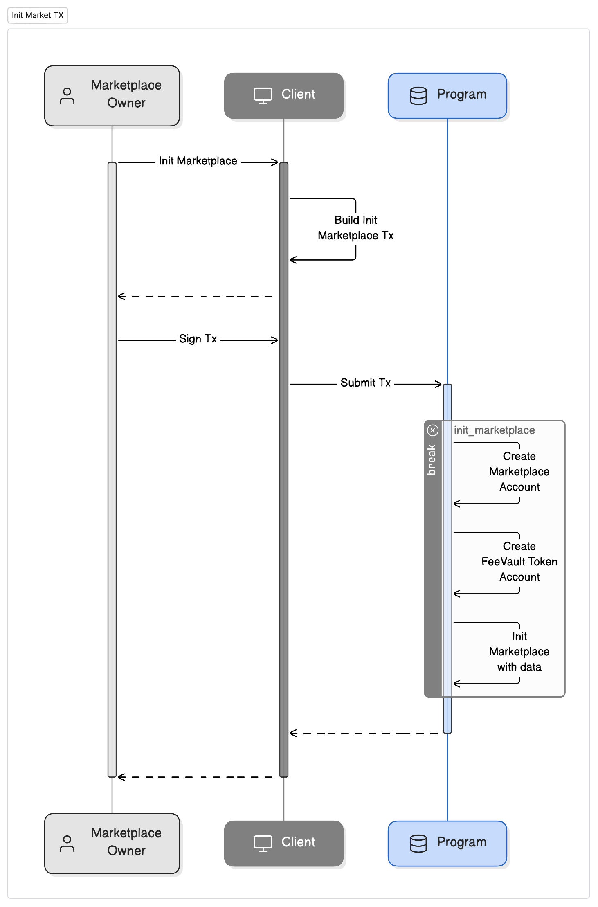

**Init market instruction Data Flow**

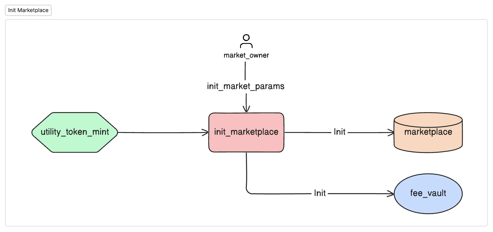

---

### How to build the TX to update the marketplace

- Step 1: Send transaction with 1 instruction - updateMarketplace - Signers: Marketplace Owner. - Accounts: - Marketplace Owner (required): This account is Signer and Payer for transaction fee (is signer), other rent fees and also assigned as owner of marketplace. - Params: - Swap fee: update swap fee attributes - Trade fee: used for determining how to calculate trade fee - Trade fee type: - percentage: calculate fee base on trading amount and **trade fee** - fixed: fixed fee (equal to **trade fee **above) - Bonding curve: update bonding curve attributes - Curve type: used for determining the calculation formula in curve - exponential: use Exponential Bonding Curves formula - constant_product: use Constant Product formula - Curve params: an array with 4 element used for calculate price in curve - [1]: Price Coefficient - [2]: Exponential Factor - [3]: ... - [4]: ...
  **Reference**: [update_marketplace.ts](https://gitlab.var-meta.com/solana-token-pump/solana-token-pump-program/-/blob/main/tests/transactions/exponential.update_marketplace.ts?ref_type=heads#:~:text=PRECISION)%3B-,const%20tx%20%3D%20await%20newTransaction(%5B,)%3B,-await%20calculateFees()

```
const tx = await newTransaction([
  await program.methods
    .updateMarketplace(
      initialTokenSupply,
      maxTokenSupply,
      dexTokenSupply,
      {
        tradeFee: new anchor.BN(newTradeFee),
        tradeFeeType: newTradeFeeType,
      },
      {
        curveType: newCurveType,
        curveParams: newCurveParams,
      }
    )
    // Implied by anchor
    // .accounts({
    //   marketplaceOwner: MARKETPLACE_OWNER.publicKey,
    // })
    .transaction(),
]);

tx.feePayer = MARKETPLACE_OWNER.publicKey;
tx.sign(MARKETPLACE_OWNER);

await confirmTransaction(
  await provider.connection.sendRawTransaction(tx.serialize())
);
```

**TX Sequence Diagram:**

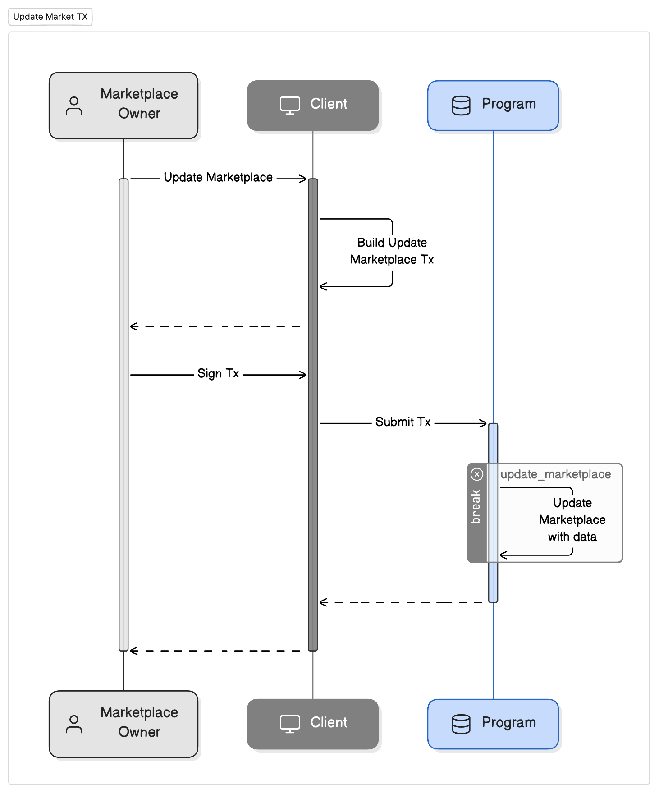

**Init market instruction Data Flow**

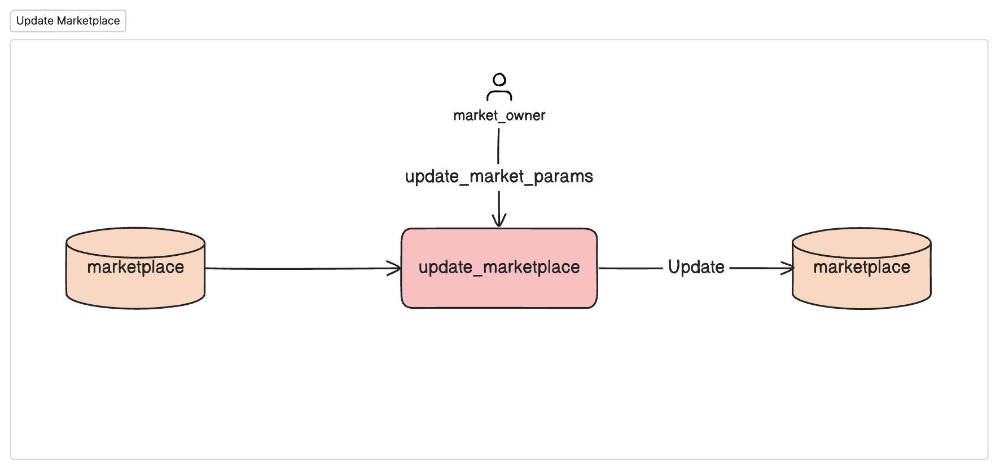

---

### How to build the TX to close the marketplace

- Step 1: Send transaction with 1 instruction - closeMarketplace - Signers: Marketplace Owner. - Accounts: - Marketplace Owner (required): This account is Signer and Payer for transaction fee (is signer), other rent fees and also assigned as owner of marketplace.
  **Reference**: [close_marketplace.ts](https://gitlab.var-meta.com/solana-token-pump/solana-token-pump-program/-/blob/main/tests/transactions/close_marketplace.ts?ref_type=heads)

```
const tx = await newTransaction([
  await program.methods
    .closeMarketplace()
    .accounts({
      ownerUtilityTokenAccount,
    })
    // Implied by anchor
    // .accounts({
    //   owner: MARKETPLACE_OWNER.publicKey,
    // })
    .transaction(),
]);

tx.feePayer = MARKETPLACE_OWNER.publicKey;
tx.sign(MARKETPLACE_OWNER);

await confirmTransaction(
  await provider.connection.sendRawTransaction(tx.serialize())
);
```

**TX Sequence Diagram:**

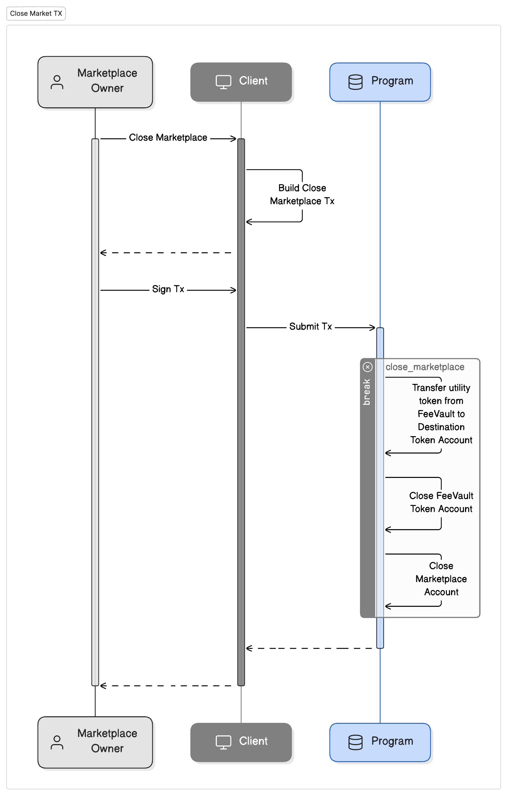

**Init market instruction Data Flow**


---

### How to build the TX to claim fee from the marketplace

- Step 1: Send transaction with 1 instruction - claimFee - Signers: Marketplace Owner. - Accounts: - Owner (required): This account is Signer and Payer for transaction fee (is signer), other rent fees and also assigned as owner of marketplace. - Claim fees destination (required): Associated token account containing to receive claimed fees, you can chose any token account you want.
  **Reference**: [claim_fee.ts](https://gitlab.var-meta.com/solana-token-pump/solana-token-pump-program/-/blob/main/tests/transactions/claim_fee.ts?ref_type=heads)

```
const tx = await newTransaction([
  await program.methods
    .claimFee(new anchor.BN(LAMPORTS_PER_SOL))
    .accounts({
      claimFeeDestination: claimerATA.address,
    })
    // Implied by anchor
    // .accounts({
    //   marketplaceOwner: MARKETPLACE_OWNER.publicKey,
    // })
    .transaction(),
]);

tx.feePayer = MARKETPLACE_OWNER.publicKey;
tx.sign(MARKETPLACE_OWNER);

await confirmTransaction(
  await provider.connection.sendRawTransaction(tx.serialize())
);
```

**TX Sequence Diagram:**

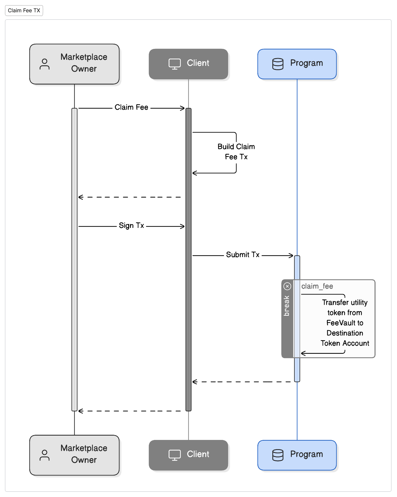

**Init market instruction Data Flow**

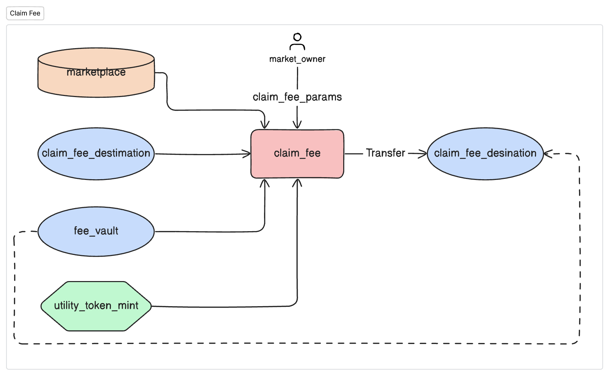

---

### How to build the TX to deposit Fee

- Step 1: Send transaction with 1 instruction - depositFee - Signers: Depositor. - Accounts: - Depositor (required): This account is Signer and Payer for transaction fee (is signer).
  **Reference**: [deposit_fee.ts](<https://gitlab.var-meta.com/solana-token-pump/solana-token-pump-program/-/blob/main/tests/transactions/deposit_fee.ts?ref_type=heads#:~:text=const%20tx%20%3D,(depositor)%3B>)

```
...

const tx = await newTransaction([
  await program.methods
    .depositFee(new anchor.BN(depositAmount))
    // Implied by anchor
    // .accounts({
    //   depositor: depositor.publicKey
    // })
    .transaction(),
]);

tx.feePayer = depositor.publicKey;
tx.sign(depositor);

...
```

**TX Sequence Diagram:**

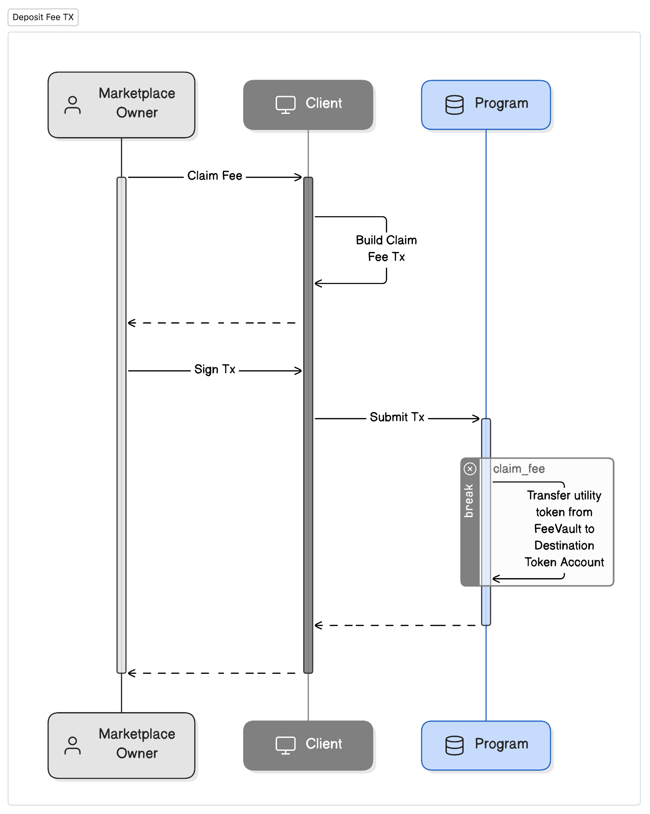

**Init market instruction Data Flow**

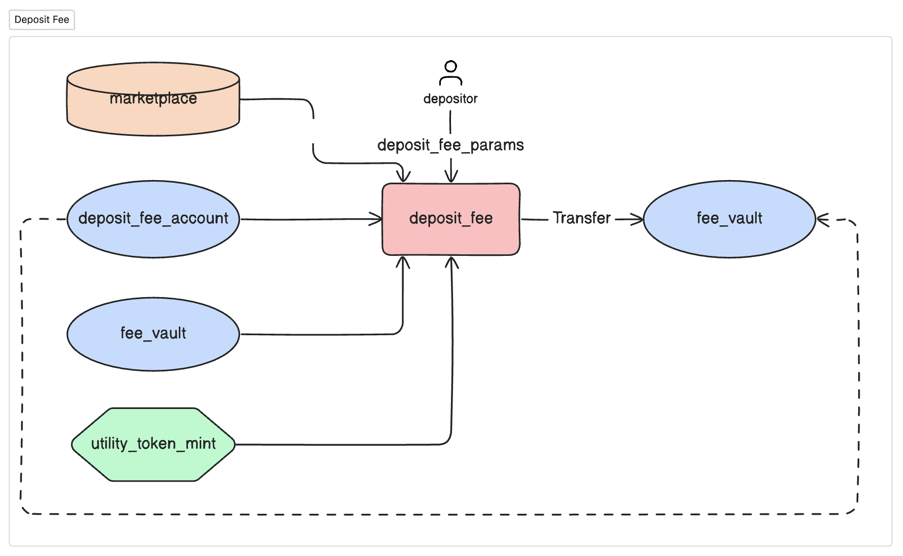

---

### How to build the TX to create the knowledge token

- Step 1: Prepare prerequisites
  - Create Utility ATA for Buyer if needed
  - Prepare enough utility token for Buyer to init new knowledge swap
- Step 2: Send transaction with 3 instruction - createToken, createTokenReserves and initSwap - Signers: - Buyer - Tx Fee payer: - Buyer - createToken: - Accounts: - Buyer (required): Payer for transaction rent fees for creating new account in instruction. - Params: - Token metadata: - name: Token name - symbol: Token Symbol - uri: Token Uri - hash: Unique hash - createTokenReserves: - Accounts: - Buyer (required): Payer for transaction rent fees for creating new account in instruction. - Params: - hash: Token unique hash. Used for determining knowledge token - initSwap: - Accounts: - Buyer (required): Is one of signers and payer for transaction rent fees, Token Creator and Swap Account creator - Params: - hash: Token unique hash. Used for determining knowledge token
  **Reference**: [exponential.create_token.ts](https://gitlab.var-meta.com/solana-token-pump/solana-token-pump-program/-/blob/main/tests/transactions/exponential.create_token.ts?ref_type=heads#:~:text=const%20tx%20%3D,%5D)%3B)

```
const tx = await newTransaction([
  await program.methods
    .createToken(tokenMetaData)
    // Implied by anchor
    // .accounts({
    //   buyer: buyer.publicKey,
    // })
    .transaction(),
  await program.methods
    .createTokenReserves({ hash: tokenMetaData.hash })
    .accounts({
      utilityTokenMint: marketplace.utilityTokenMint,
      // Implied by anchor
      // buyer: buyer.publicKey,
    })
    .transaction(),
  await program.methods
    .initSwap({
      hash: tokenMetaData.hash
    })
    // Implied by anchor
    // .accounts({
    //   buyer: buyer.publicKey,
    // })
    .transaction(),
]);

tx.feePayer = buyer.publicKey;
tx.partialSign(buyer);
tx.partialSign(buyer);

await confirmTransaction(
  await provider.connection.sendRawTransaction(tx.serialize())
);
```

**TX Sequence Diagram:**

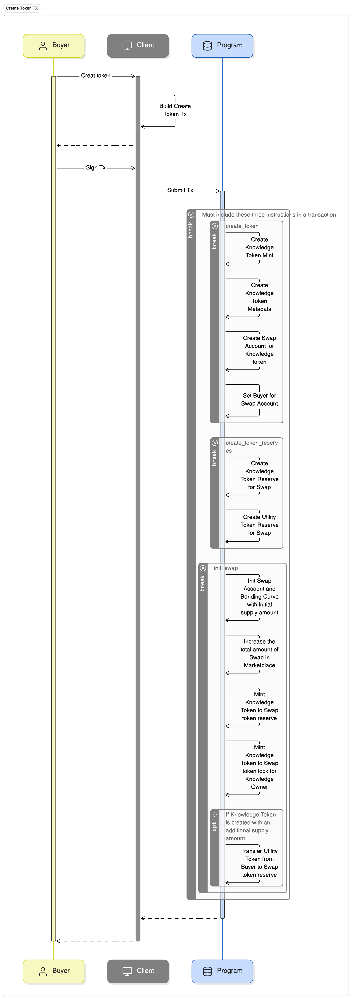

**Init market instruction Data Flow**

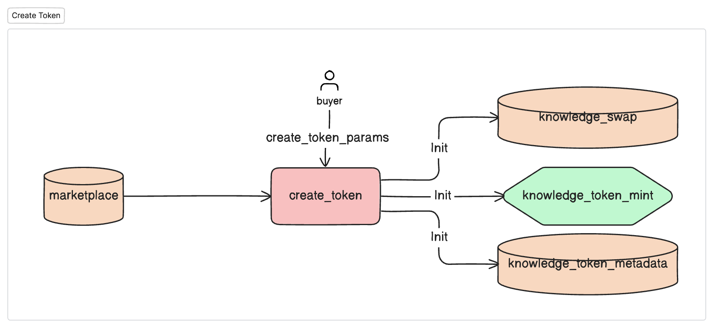

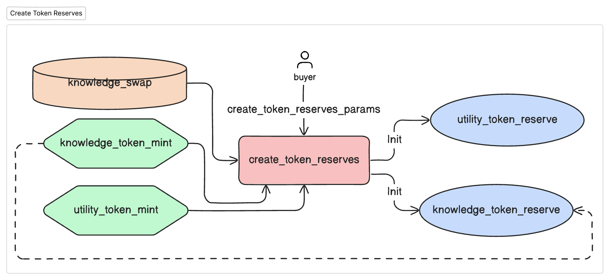

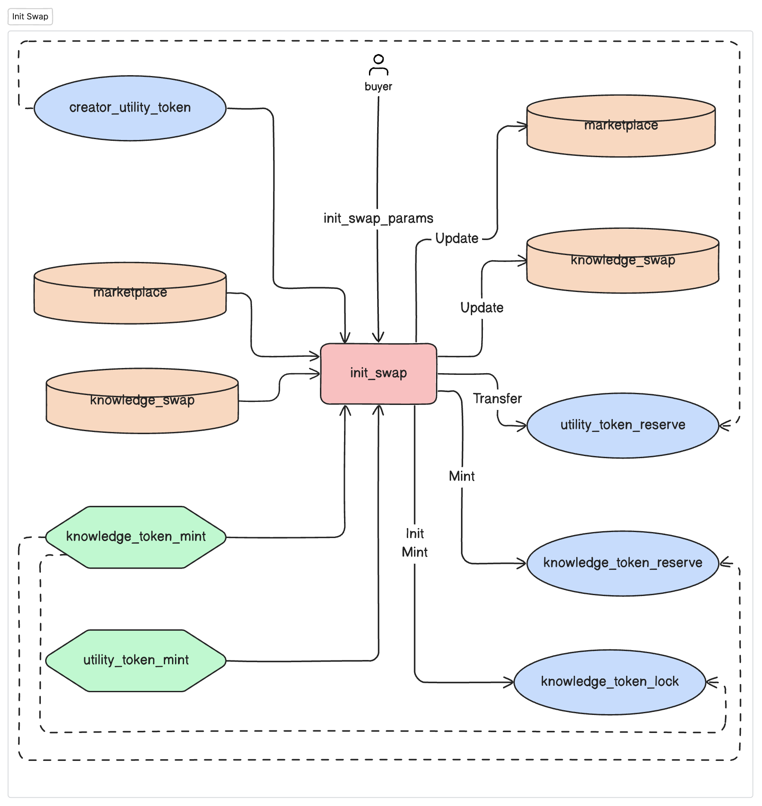

---

### How to build the TX to buy the knowledge token

- Step 1: Send a `createToken` tx to create new token if the token haven't existed onchain
  - Refer to\*\* \*\*[How to build the TX to create the knowledge token](https://app.eraser.io/workspace/Mj1wSmRBH0A4u9kkcdJb#8PF5C4BaQ141tmzowXDDY)
- Step 2: Prerequisite
  - Create Knowledge ATA account for buyer if needed
  - Create Utility ATA account for buyer if needed
  - Prepare enough utility token for buyer before buying
- Step 3: Send a transaction with 1 instruction - buyToken - Signers: Buyer - Tx Fee payer: Buyer - createToken: - Accounts: - Buyer (required): Payer for transaction rent fees for creating new accounts in instruction. - Knowledge Token Mint (required): used for determining knowledge swap and transfering Knowledge token.
  **Reference**: [exponential.buy_token.ts](<https://gitlab.var-meta.com/solana-token-pump/solana-token-pump-program/-/blob/main/tests/transactions/exponential.buy_token.ts?ref_type=heads#:~:text=await%20getKnowledgeSwap(knowledgeSwapPDA)%3B-,//%20If%20the%20token%20have%20not%20been%20created%20%2D%3E%20Create%20new%20token,>)%3B,-feesArray.push(await)

```
...

// If the token have not been created -> Create new token
const tx = await newTransaction([
  await program.methods
    .createToken(tokenMetaData)
    // Implied by anchor
    // .accounts({
    //   buyer: buyer.publicKey,
    // })
    .transaction(),
  await program.methods
    .createTokenReserves({ hash: tokenMetaData.hash })
    .accounts({
      utilityTokenMint: marketplace.utilityTokenMint,
      // Implied by anchor
      // buyer: buyer.publicKey,
    })
    .transaction(),
  await program.methods
    .initSwap({
      hash: tokenMetaData.hash
    })
    // Implied by anchor
    // .accounts({
    //   buyer: buyer.publicKey,
    // })
    .transaction(),
]);

tx.feePayer = buyer.publicKey;
tx.partialSign(buyer);
tx.partialSign(buyer);

await confirmTransaction(
  await provider.connection.sendRawTransaction(tx.serialize())
);

...

const tx = await newTransaction([
  await program.methods
    .buyToken(utilityTokenIn, mintAmountOut)
    .accounts({
      // Implied by anchor
      // buyer: buyer.publicKey,
      knowledgeTokenMint: knowledgeSwap.knowledgeTokenMint,
    })
    .transaction(),
]);

tx.feePayer = buyer.publicKey;
tx.sign(buyer);

await confirmTransaction(
  await provider.connection.sendRawTransaction(tx.serialize())
);

...
```

**TX Sequence Diagram:**

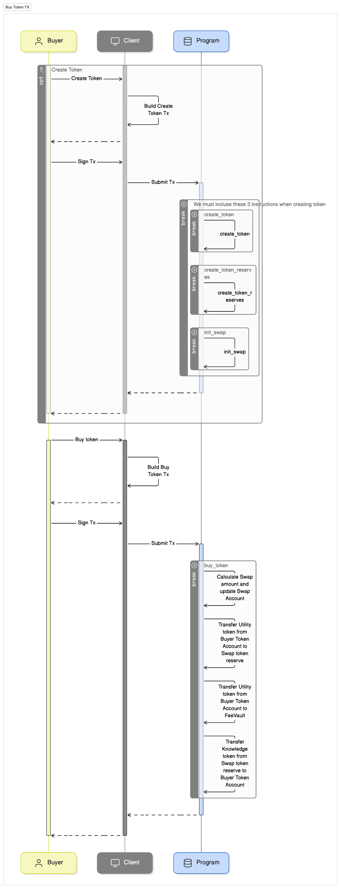

**Init market instruction Data Flow**

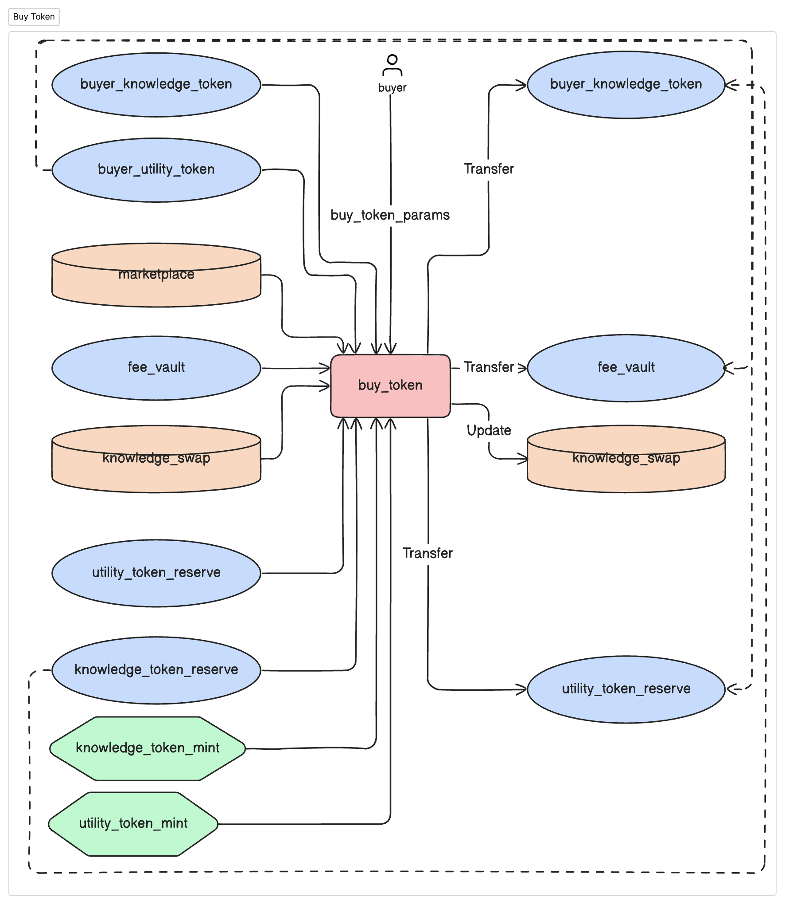

---

### How to build the TX to sell the knowledge token

- Step 1: Send a transaction with 1 instruction - sellToken - Signers: Seller - Tx Fee payer: Seller - Accounts: - Seller (required): Payer for transaction rent fees for creating new accounts in instruction. - Knowledge Token Mint (required): used for determining knowledge swap and transfering Knowledge token.
  **Reference: **[exponential.sell_token.ts](<https://gitlab.var-meta.com/solana-token-pump/solana-token-pump-program/-/blob/main/tests/transactions/exponential.sell_token.ts?ref_type=heads#:~:text=.amount%3B-,const%20tx%20%3D%20await%20newTransaction(%5B,)%3B,-const%20expectedTradeFee%20%3D>)

```
...

const tx = await newTransaction([
  await program.methods
    .sellToken(
      sellKnowledgeTokenAmount,
      new anchor.BN(
        (utilityTokenBefore.toNumber() -
          expectedRemainingUtilityTokenAmount) *
          0.99
      )
    )
    .accounts({
      // Implied by anchor
      // seller: seller.publicKey,
      knowledgeTokenMint: knowledgeSwap.knowledgeTokenMint,
    })
    .transaction(),
]);

tx.feePayer = seller.publicKey;
tx.sign(seller);

await confirmTransaction(
  await provider.connection.sendRawTransaction(tx.serialize())
);

...
```

**TX Sequence Diagram:**

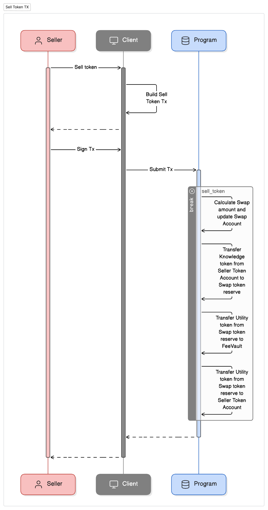

**Init market instruction Data Flow**

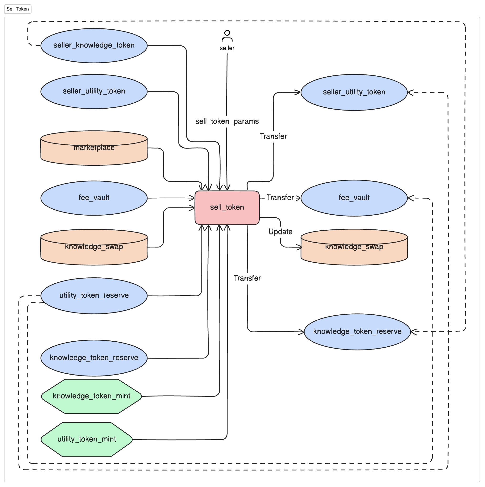

---

### [Free claim] How to build the TX to claim knowledge token

- Step 1: Send a transaction with 1 instruction - claimFreeToken - Signers: Marketplace Owner - Tx Fee payer: Marketplace Owner - Accounts: - Marketplace Owner (required): Payer for transaction rent fees for creating new accounts in instruction. - Knowledge Token Mint (required): used for determining knowledge swap and transfering Knowledge token. - Params: - Claim Amount: Free knowledge token amount to claim
  **Reference**: [exponential.claim_free_token.ts](https://gitlab.var-meta.com/solana-token-pump/solana-token-pump-program/-/blob/main/tests/transactions/exponential.claim_free_token.ts?ref_type=heads#:~:text=)%3B-,const%20tx%20%3D%20await%20newTransaction(%5B,)%3B,-const%20knowledgeSwapAfter%20%3D)

```
...

const tx = await newTransaction([
  await program.methods
    .claimFreeToken(claimAmount)
    .accounts({
      // Implied by anchor
      // marketplaceOwner: marketplaceOwner.publicKey,
      knowledgeTokenMint,
    })
    .accounts({
      knowledgeTokenMint,
    })
    .transaction(),
]);

tx.feePayer = marketplaceOwner.publicKey;
tx.sign(marketplaceOwner);

await confirmTransaction(
  await provider.connection.sendRawTransaction(tx.serialize())
);

...
```

**TX Sequence Diagram:**

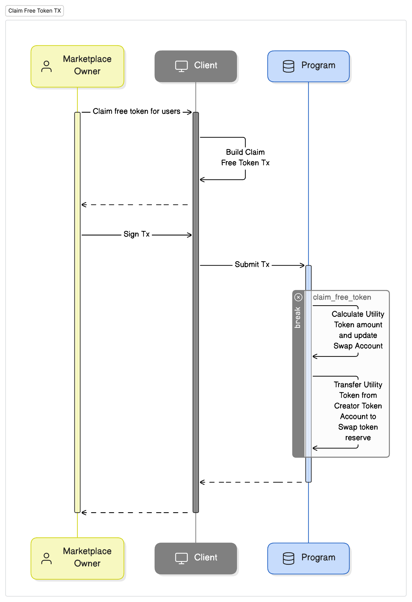

**Init market instruction Data Flow**

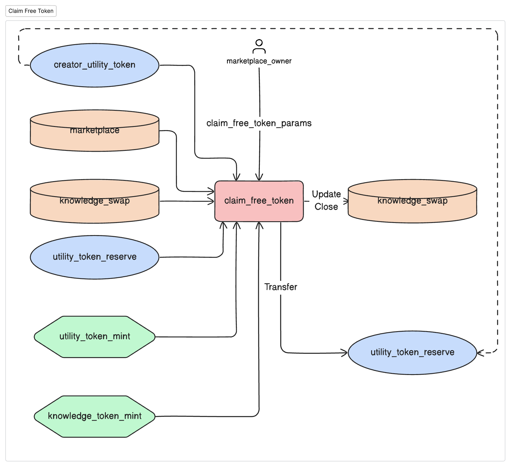

---

### [Free claim] How to build the TX to sell the claimed knowledge token

- Step 1: Send a transaction with 2 instruction - claimFreeToken & sellFreeToken - Add a `claimFreeToken` instruction to transaction to claim free token first if there wasn't any free token claimed onchain. Refer to: [[Free claim] How to build the TX to claim knowledge token](https://app.eraser.io/workspace/Mj1wSmRBH0A4u9kkcdJb#AOBOllFF4O7YGH6hn266-) - sellFreeToken - Signers: Marketplace Owner - Tx Fee payer: Marketplace Owner - Accounts: - Marketplace Owner (required): Payer for transaction rent fees for creating new accounts in instruction. Must pass exactly the swap creator account of current Knowledge Swap - Knowledge Token Mint (required): used for determining knowledge swap and transfering Knowledge token. - Requester Utility Token (required): An associated utility token account to receive utility token after selling free token - Params: - Sell Amount: Free knowledge token amount to sell
  **Reference**: [exponential.sell_free_token.ts](https://gitlab.var-meta.com/solana-token-pump/solana-token-pump-program/-/blob/main/tests/transactions/exponential.sell_free_token.ts?ref_type=heads)

```
...

const tx = await newTransaction(
  [
    needClaim &&
      (await program.methods
        .claimFreeToken(sellKnowledgeTokenAmount)
        .accounts({
          // Implied by anchor
          // creator: swapCreator.publicKey,
          knowledgeTokenMint: knowledgeSwap.knowledgeTokenMint,
        })
        .accountsPartial({
          creatorUtilityToken: creatorUtilityTokenAccount.address,
          utilityTokenMint: knowledgeSwap.utilityTokenMint,
        })
        .transaction()),
    await program.methods
      .sellFreeToken(sellKnowledgeTokenAmount)
      .accounts({
        // Implied by anchor
        // creator: swapCreator.publicKey,
        requesterUtilityToken: requestorUtilityTokenAccount.address,
        knowledgeTokenMint: knowledgeSwap.knowledgeTokenMint,
      })
      .transaction(),
  ].filter((item) => !!item)
);

tx.feePayer = swapCreator.publicKey;
tx.sign(swapCreator);

await confirmTransaction(
  await provider.connection.sendRawTransaction(tx.serialize())
);

...
```

**TX Sequence Diagram:**

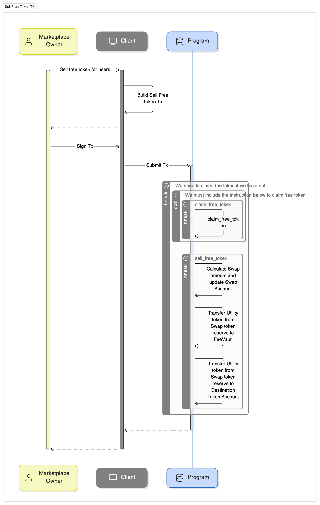

**Init market instruction Data Flow**

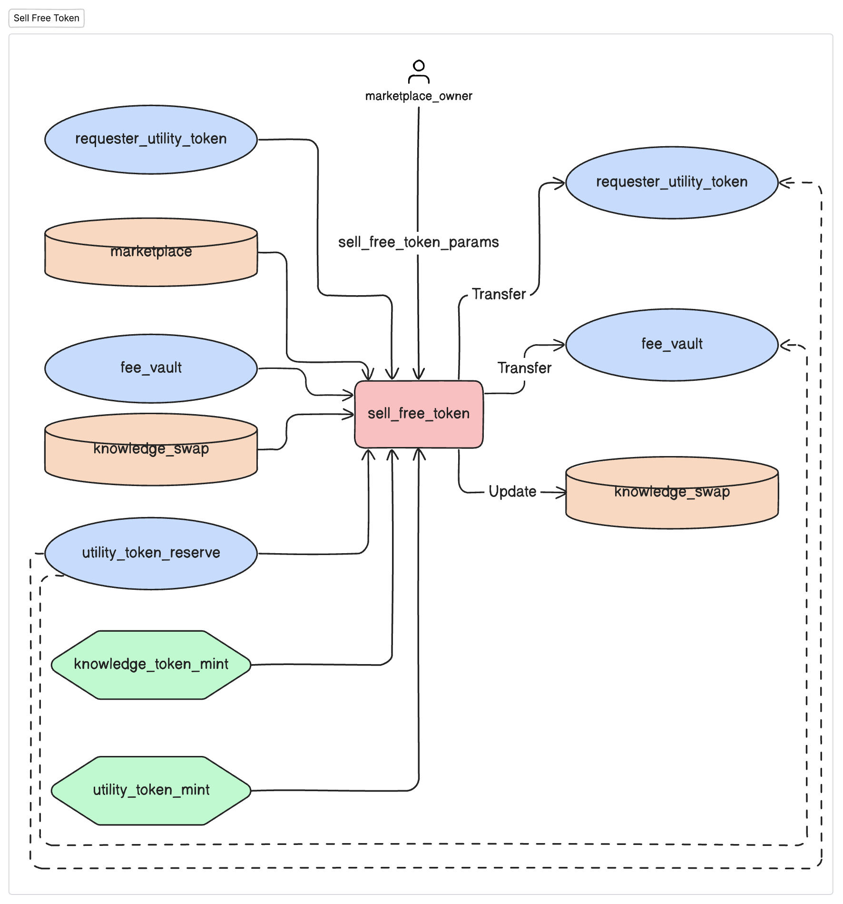

---

### [Knowledge Owner] How to build the TX to create token vesting

- Step 1: Send a transaction with 1 instruction - createTokenVesting - Signers: Marketplace Owner - Tx Fee payer: Marketplace Owner - createTokenVesting: - Accounts: - Marketplace Owner (required): Payer for transaction rent fees for creating new accounts in instruction. - Knowledge Token Mint (required): used for determining knowledge swap and transfering Knowledge token. - Params: - lastClaimedTimestamp: last claim timestamp from off chain data, used for checking unlock knowledge token - Swap Owner: Owner account of knowledge swap. Used for assign owner to swap and also locking knowledge token.
  **Reference**: [exponential.claim_initial_supply_token.ts](https://gitlab.var-meta.com/solana-token-pump/solana-token-pump-program/-/blob/main/tests/transactions/exponential.claim_initial_supply_token.ts?ref_type=heads)

```
...

const transaction = await newTransaction([
  await program.methods
    .createTokenVesting(lastClaimAtMilliseconds, swapOwner.publicKey)
    .accounts({
      // Implied by anchor
      // markplaceOwner: markplaceOwner.publicKey,
      knowledgeTokenMint: knowledgeSwap.knowledgeTokenMint,
    })
    .transaction(),
]);

transaction.feePayer = markplaceOwner.publicKey;
transaction.sign(markplaceOwner);

await confirmTransaction(
  await provider.connection.sendRawTransaction(transaction.serialize())
);

...
```

**TX Sequence Diagram:**

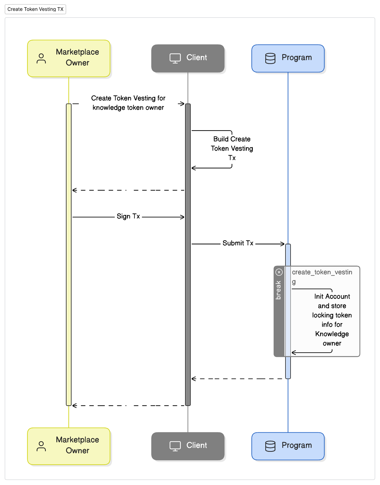

**Init market instruction Data Flow**

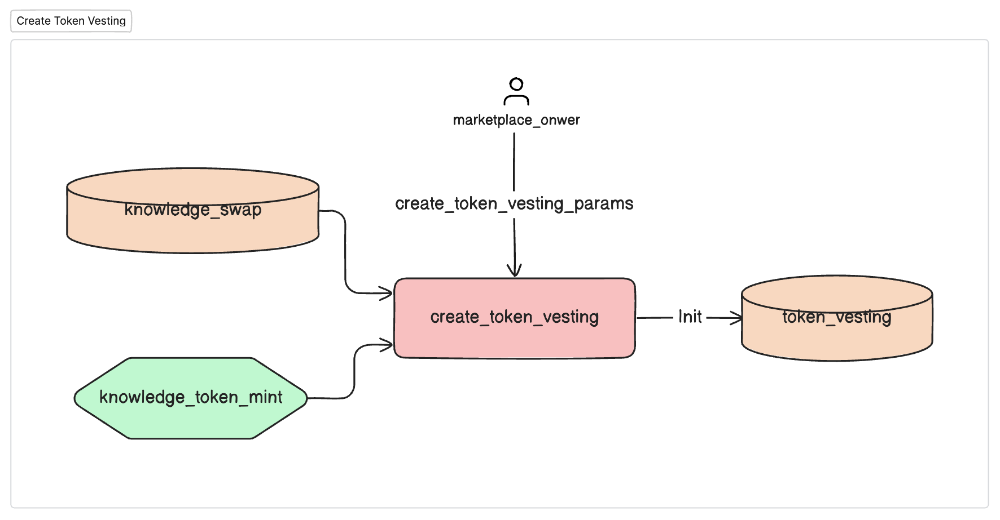

---

### [Knowledge Owner] How to build the TX to unlock the claimed knowledge token

- Step 1: Send a `createTokenVesting` tx to start to claim knowledge owner supply is there wasn't locked account.
  - Refer to\*\* \*\*[ [Knowledge Owner] How to build the TX to create token vesting ](https://app.eraser.io/workspace/Mj1wSmRBH0A4u9kkcdJb#PTcae359hiQrZBM2rvvmM)
- Step 2: Send a transaction with 1 instruction - unlockTokenVesting - Signers: Knowledge Owner - Tx Fee payer: Knowledge Owner - unlockInitialSupplyToken: - Accounts: - Knowledge Owner (required): Payer for transaction rent fees for creating new accounts in instruction. - Knowledge Token Mint (required): used for determining knowledge swap and transfering Knowledge token. - Params: - unlockAmount: specific amount to unlock, choose amount receive (have to less than total available amount in current period) - unlockTimestamp: Mocked unlock timestamp, only for testing.
  **Reference**: [exponential.unlock_initial_supply_token.ts](https://gitlab.var-meta.com/solana-token-pump/solana-token-pump-program/-/blob/main/tests/transactions/exponential.unlock_initial_supply_token.ts?ref_type=heads)

```
...

// If the initial supply have not been created -> Claim initial supply
if (!tokenVesting) {
  const fees = await await claimInitialSupplyToken.runTest(
    config,
    tokenMetaData,
    knowledgeOwner,
    marketplaceOwner
  );

  fees && feesArray.push(fees);
}

...
...

const tx = await newTransaction([
  computeBudgetInstruction,
  await program.methods
    .unlockTokenVesting(
      // If the index eq 2 or 3, a half of unlockable amount
      partialUnlockIndexes.includes(index) ? expectedAmountToUnlock : null,
      mockedUnlockDate
    )
    .accounts({
      // Implied by anchor
      // knowledgeOwner: knowledgeOwner.publicKey,
      knowledgeTokenMint: knowledgeSwap.knowledgeTokenMint,
    })
    .transaction(),
]);

tx.feePayer = knowledgeOwner.publicKey;
tx.sign(knowledgeOwner);

await confirmTransaction(
  await provider.connection.sendRawTransaction(tx.serialize())
);

...
```

**TX Sequence Diagram:**

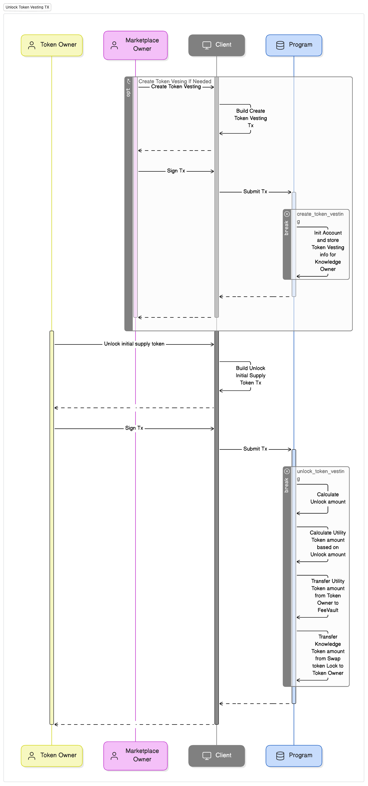

**Init market instruction Data Flow**

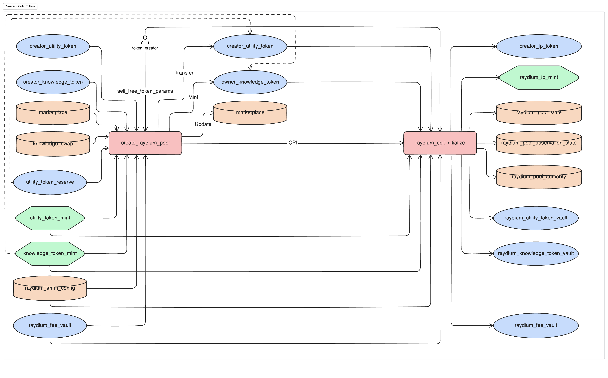

---

### How to build the TX to create Raydium pool

- Step 1: Send a transaction with 2 instruction - flashDistributeAdditionalPairAmount & createRaydiumPool - Signers: Operator - Tx Fee payer: Operator - flashDistributeAdditionalPairAmount - Accounts: - Operator: Anyone who pay for tx fee and sign - Operator Utility Token (required): A token account containing utility token of Operator. Used for receiving utility token prepared for utility token dex supply - Operator Knowledge Token (required): A associated token account containing utility token of Operator. Used for receiving knowledge token prepared for knowledge token dex supply.  
   - Knowledge Token Mint (required): used for determining knowledge swap and transfering Knowledge token. - createRaydiumPool - Accounts: Anyone who pay for tx fee and sign - Operator: Must pass exactly the swap Operator account of current Knowledge Swap - Token 0 Mint: Is knowledge token mint if Token 0 Mint address < Token 1 Mint address and vice versa. - Token 1 Mint : Is utility token mint if Token 0 Mint address < Token 1 Mint address and vice versa. - Creator Token 0 Mint: Is associated token account of knowledge token mint's creator if Token 0 Mint address < Token 1 Mint address and vice versa. - Creator Token 1 Mint: Is associated token account of utility token mint's creator if Token 0 Mint address < Token 1 Mint address and vice versa. - Token 0 Program: Is program of knowledge token if Token 0 Mint address < Token 1 Mint address and vice versa. - Token 1 Program: Is program of utility token if Token 0 Mint address < Token 1 Mint address and vice versa. - Raydium Amm Config: Account contain config the pool belongs to. [Config](https://gitlab.var-meta.com/solana-token-pump/solana-token-pump-program/-/blob/main/tests/config.ts?ref_type=heads#:~:text=export%20const%20cpmmConfigAddress,)%3B) from mainnet and also used for testing by pulling[ raydium program](https://gitlab.var-meta.com/solana-token-pump/solana-token-pump-program/-/blob/main/local_programs/raydium_cpmm_cpi.so?ref_type=heads) from mainnet cluster. - Creator LP Token: LP Token Mint Address (token represent for pool pair). Check how to retrive [here.](<https://gitlab.var-meta.com/solana-token-pump/solana-token-pump-program/-/blob/main/tests/transactions/create_raydium_pool.ts?ref_type=heads#:~:text=knowledgeSwap.utilityTokenMint%3B-,const%20%5BpoolAddress%5D%20%3D%20getRaydiumPoolAddress(,)%3B,-const%20creatorKnowledgeToken%20%3D>) - Params: - distributeInstructionIndex: index of distribute instruction in current transaction, used for validation purpose (should be 0) - knowledgeTokenMint: Address of knowledge token mint, used for validation purpose (have to match with knowledge token mint in distributeAdditionalPairAmount instruction)
  **Reference**: [create_raydium_pool.ts](https://gitlab.var-meta.com/solana-token-pump/solana-token-pump-program/-/blob/main/tests/transactions/create_raydium_pool.ts?ref_type=heads)

```
...

const pairInfo = isToken0KnowledgeToken
  ? {
      token0Mint: knowledgeSwap.knowledgeTokenMint,
      token1Mint: knowledgeSwap.utilityTokenMint,
      operatorToken0: operatorKnowledgeToken,
      operatorToken1: operatorUtilityToken,
      token0Program: TOKEN_PROGRAM_ID,
      token1Program: TOKEN_PROGRAM_ID,
    }
  : {
      token0Mint: knowledgeSwap.utilityTokenMint,
      token1Mint: knowledgeSwap.knowledgeTokenMint,
      operatorToken0: operatorUtilityToken,
      operatorToken1: operatorKnowledgeToken,
      token0Program: TOKEN_PROGRAM_ID,
      token1Program: TOKEN_PROGRAM_ID,
    };

const distributeTx = await program.methods
  .flashDistributeAdditionalPairAmount()
  .accounts({
    knowledgeTokenMint: knowledgeSwap.knowledgeTokenMint,
  })
  .transaction();

const createTx = await program.methods
  .createRaydiumPool(0, knowledgeSwap.knowledgeTokenMint)
  .accounts({
    ...pairInfo,
    raydiumAmmConfig: config.raydiumAmmConfig,
    operatorLpToken: operatorLpTokenAddress,
  })
  .transaction();

const tx = await newTransaction([distributeTx, createTx]);

tx.feePayer = operator.publicKey;

tx.sign(operator);

await confirmTransaction(
  await provider.connection.sendRawTransaction(tx.serialize())
);

...
```

**TX Sequence Diagram:**

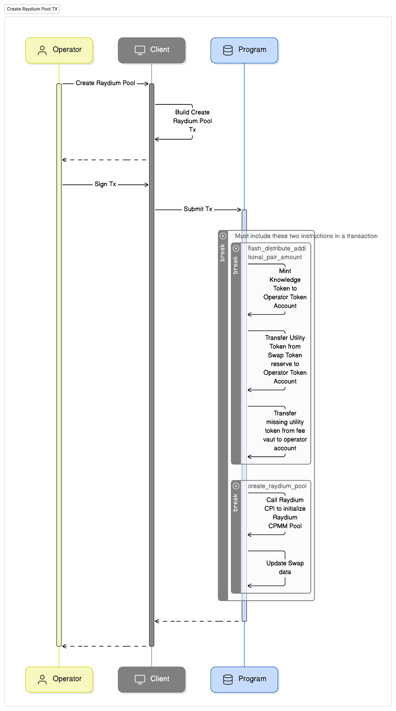

**Init market instruction Data Flow**


---

### How to build the TX to close Swap

- Step 1: Send a transaction with 1 instruction - closeSwap - Signers: Marketplace Owner - Tx Fee payer: Marketplace Owner - closeSwap: This instruction can be called multiple times until all the accounts relating to swap were closed - Accounts: - Marketplace Owner (required): Receive token when close accounts - Knowledge Token Mint (required): used for determining knowledge swap and transfering Knowledge token. - Token Vesting (optional): Token Vesting address if it have been created. - Params: - isForcedClose: force close token vesting.
  **Reference**: [exponential.close_swap.ts](https://gitlab.var-meta.com/solana-token-pump/solana-token-pump-program/-/blob/main/tests/transactions/exponential.close_swap.ts?ref_type=heads#:~:text=const%20tx%20%3D,%5D)%3B)

```
...

const tx = await newTransaction([
  await program.methods
    .closeSwap(isForcedClose)
    .accounts({
      knowledgeTokenMint: knowledgeTokenMintAddress,
      tokenVesting: tokenVestingAddress,
    })
    .transaction(),
]);

tx.feePayer = marketplaceOwner.publicKey;
tx.sign(marketplaceOwner);

...
```

**TX Sequence Diagram:**

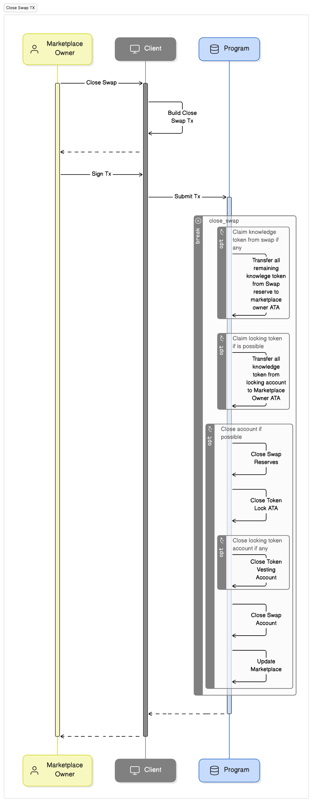

**Init market instruction Data Flow**

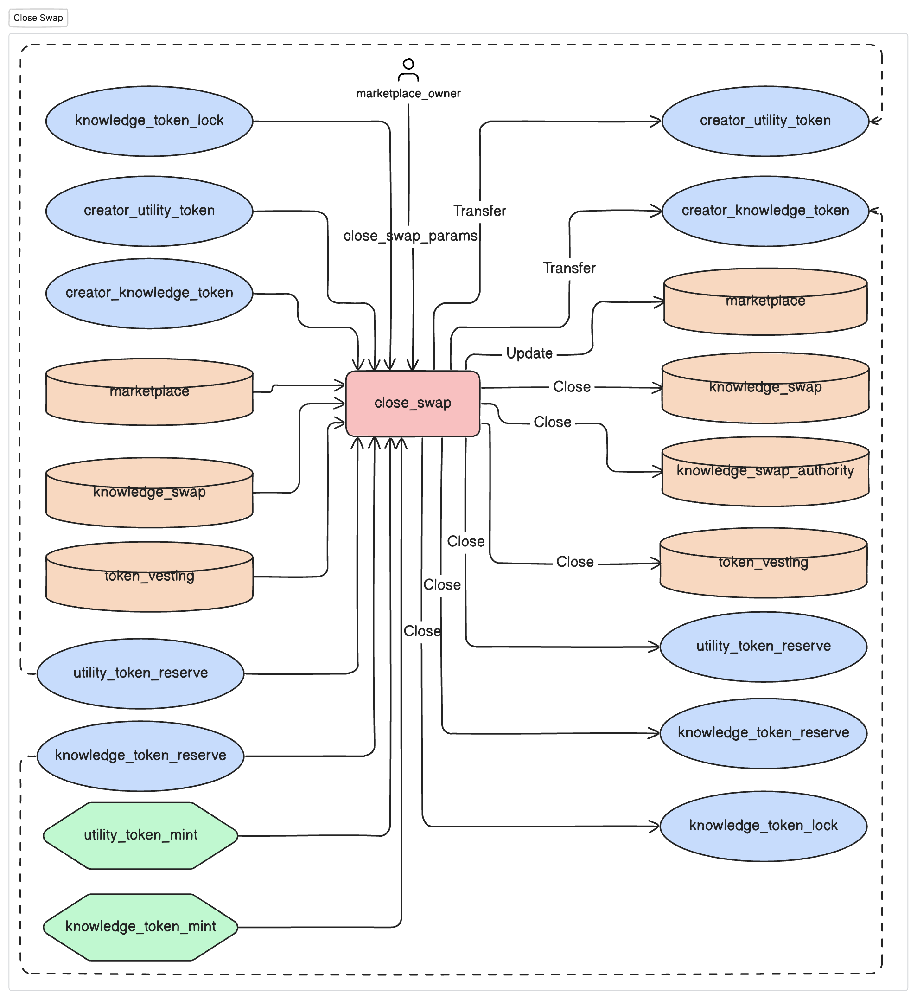

---

### How to build the TX to close Marketplace

- Step 1: Send a transaction with 1 instruction - closeMarketplace - Signers: Marketplace Owner - Tx Fee payer: Marketplace Owner - closeMarketplace: - Accounts: - Marketplace Owner (required): Receive token when close accounts - Claim Fee Destination (required): used for receiving token after closing marketplace.
  **Reference**: [exponential.close_swap.ts](https://gitlab.var-meta.com/solana-token-pump/solana-token-pump-program/-/blob/main/tests/transactions/exponential.close_swap.ts?ref_type=heads#:~:text=const%20tx%20%3D,%5D)%3B)

```
...

const tx = await newTransaction([
  await program.methods
    .closeMarketplace()
    .accounts({
      claimFeeDestination: marketplaceOwnerUtilityATA.address,
    })
    .transaction(),
]);

tx.feePayer = marketplaceOwner.publicKey;
tx.sign(marketplaceOwner);
...
```

**TX Sequence Diagram:**


**Init market instruction Data Flow**

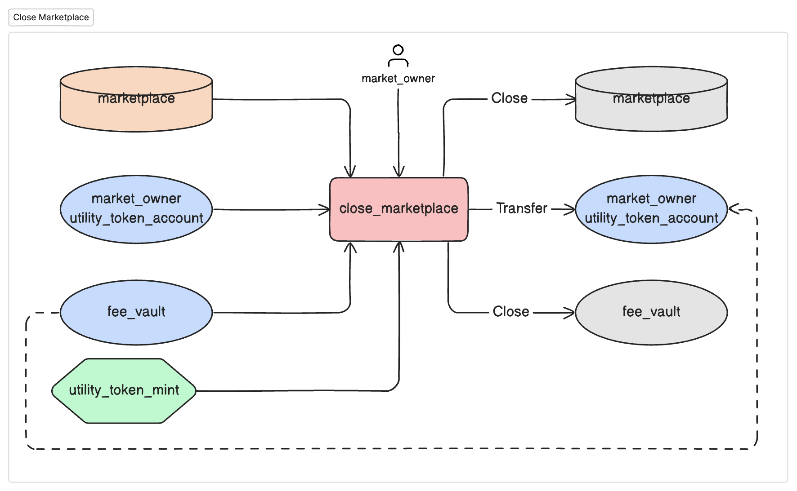
